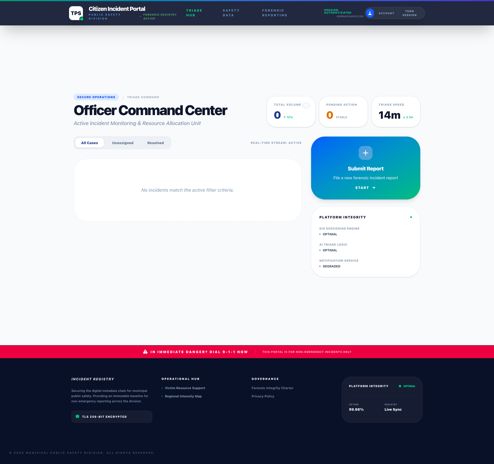

# TPS Incident Report

Monorepo for the TPS Incident Report platform. The project includes:

- A public-facing Angular client for report submission and status tracking.
- A NestJS API for authentication, report workflows, and operational dashboards.

Live URL: https://tps-incident.ssowemimo.com/

## Preview



Place the screenshot at `docs/images/tps-incident-dashboard-preview.png` to render this preview.

## Repository Structure

```text
.
├── client/   # Angular app (@incident-report/client)
├── server/   # NestJS API (@incident-report/server)
├── README.md
└── package.json (workspace root)
```

## Tech Stack

- Frontend: Angular 21, Tailwind CSS 4, RxJS
- Backend: NestJS 11, TypeORM, PostgreSQL, JWT Auth
- Infra/Deploy: Railway, Vercel-compatible client build, npm workspaces

## Prerequisites

- Node.js 22+
- npm 10+

## Quick Start

From repository root:

```bash
npm run install:all
npm run dev
```

Default local services:

- Client: http://localhost:4200
- Server: http://localhost:3000 (or configured `PORT`)

## Workspace Scripts (Root)

| Script                 | Description                                               |
| ---------------------- | --------------------------------------------------------- |
| `npm run dev`          | Runs client and server concurrently in watch mode.        |
| `npm run dev:client`   | Starts Angular dev server only.                           |
| `npm run dev:server`   | Starts NestJS in watch mode only.                         |
| `npm run build`        | Builds client then server.                                |
| `npm run build:client` | Builds Angular client.                                    |
| `npm run build:server` | Builds NestJS server.                                     |
| `npm run test`         | Runs client tests then server tests.                      |
| `npm run lint`         | Runs server linting.                                      |
| `npm run clean`        | Removes workspace build artifacts and local dependencies. |

## Environment Variables

Create local `.env` files as needed (typically in `server/` and `client/`).

Typical backend variables:

- `PORT`
- `DATABASE_URL`
- `SUPABASE_URL`
- `SUPABASE_ANON_KEY`
- `SUPABASE_JWT_SECRET`
- Any app-specific auth/role configuration variables used in `server/src`

Keep secrets out of source control. See `.gitignore` for ignored env patterns.

## Build and Run in Production

### Client

```bash
npm run build:client
npm run start:client
```

### Server

```bash
npm run build:server
npm run start:server
```

## Deployment Notes

- Root `railway.toml` is configured for backend deployment in this monorepo.
- `client/railway.toml` can be used for frontend hosting when deploying client separately.
- Ensure Railway/Vercel environment variables are set before promoting builds.

## Development Guidelines

- Use root scripts for day-to-day development in the monorepo.
- Keep client and server dependencies scoped to their workspace unless truly shared.
- Run `npm run build` before merging major changes.

## License

UNLICENSED - Internal project.
